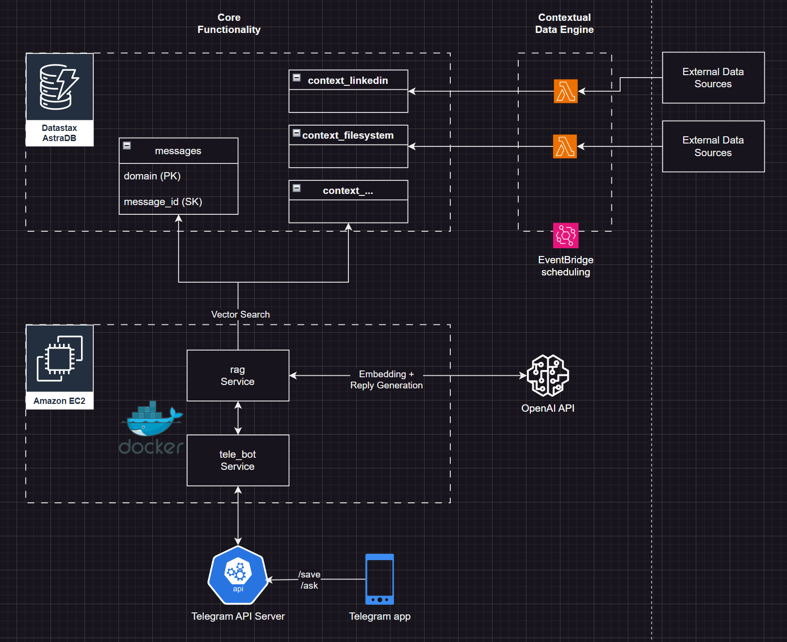

# telegram-rag
Telegram Bot that uses LLM to write, store, and retrieve your sporadic thoughts.

# Project Plan

Motivation:

Having gone through many note taking apps, I find myself defaulting to the 'Saved Messages' function in Telegram. It's accessible, quick, and most importantly **everything** is stored in a single location, allowing me to do efficient keyword searches. This is important when I inevitably forget the background of the people I'm about to meet at a conference, or when I want to know what I was learning about last week on the train.

My user journey:

1. Something triggers me to write down notes - a YT video, meeting someone, an interesting article, etc.
2. I hurriedly type notes in my Saved Messages - notes that are full of typos, run-on sentences, and no context other than a few http links.
3. Occasionally, I review my Saved Messages to see if there are any items for me to act on, or formally write about in my journal.
4. Weeks later, I search through those messages to find information about a specific person I met. And then I search up their name on LinkedIn to familiarise myself.

Is there a way to make this entire process more consolidated and 'smarter'?

Requirements:

1. A service that handles the message content sent to Telegram servers when I do either a `/save` or `/ask` command to the bot in Telegram app, and then forwards that request to another service to handle the retrieval portion.
   
2. A service that, depending on whether it sent a request at a `/save` or `/ask` endpoint, will run the necessary LLM embedding, retrieval, and reply generation with the accompanying text `{content}`.

Approach:

This is basically a Telegram Bot service on the front-end combined with a RAG pipeline on the backend. With this design, the RAG pipeline can be extended to plug-in any contextual data store that I want, as long as the data store is updated. 

The messages sent to the bot will be treated as the primary data store, and the contextual data stores could be my own file system, LinkedIn connection details, etc.

The bot serves as the semantic router which will determine which data stores to search on, based on the #domain that is specified in the quote. 

Let's call this application **Second Thought**

Architecture:



In terms of resource provision, I chose the lowest cost options possible. While it would have been better to keep the vector database within the AWS ecosystem, the options were all too expensive.

Datastax provides a generous free tier and serves our purpose more than sufficiently.

We will host the services as Flask apps inside docker containers on an EC2 instance. Assuming 25% utilisation, a t4g.small instance will cost < $2 per month, which is a great price. 

All other services like EventBridge and Lambda are forever free.

# Env setup

conda create -n python=3.10
pip install poetry==1.7.1
poetry install --with dev

source .env

# Log

Done setting up database and terraform 

Created functions to read and write to astra, need to see how to handle updates as well

Created functions that take in a raw text and prepare the cleaned document.

DONE 21 JUL:

- See how telegram delivers messages. I assume each message has an object_id and new writes are new id while edits are updates to the old id.

- Host this RAG as a service with endpoints like /search and /save , /update

        /search: {text + domain (if any) --> this goes to the prompt direct and triggers vector search}

        /save: {message_id, text}

        /update: {message_id, text}


- Create authentication for only my user based on userid. Reject all other users.

DONE 27 JUL:

- Host API servers on EC2 instance via Docker - only allow outbound traffic to Telegram server IPs, add an elastic IP to the EC2 for public access

Docker: Wrote the build shell script to do the following
- docker build + docker push
- ssh into the ec2 using keypair
- login to ecr via docker
- pull the image url
- kill of old containers of the same image
- create a networking bridge if not already available
- run the container with fixed name 
- the flask app (tele service) needs to send request to the container's name endpoint

Also added IAM, ECR, EC2 terraform. Note that for IAM we can create a profile using a role and attach it directly the EC2. We also need to add a policy that allows EC2s to assume the role. 

On the EC2 side, 1 time set up of installing aws cli and docker. need to add ubuntu as the sudo docker so it can start rdunning containers.

```
sudo apt-get update
sudo apt-get install apt-transport-https ca-certificates curl software-properties-common
curl -fsSL https://download.docker.com/linux/ubuntu/gpg | sudo apt-key add -
sudo add-apt-repository "deb [arch=amd64] https://download.docker.com/linux/ubuntu $(lsb_release -cs) stable"
sudo apt-get install docker-ce
sudo gpasswd -a $USER docker
sudo service docker start
[RECONNECT VIA SSH] docker run hello-world
```

```
sudo apt update
sudo apt install unzip
curl "https://awscli.amazonaws.com/awscli-exe-linux-x86_64.zip" -o "awscliv2.zip"
unzip awscliv2.zip
sudo ./aws/install
```


Since we are using long-poll which is oubound request from our EC2, we dont need to allow any inbound traffic, other than our SSH.

DONE 28 JUL:

- Added a keep-alive function that runs in a separate thread on flask as astradb will force-hibernate after 48 hours of no queries.

- Add function to write all docs written to DB to also upload as file to s3. This will be a public s3, but we will delete all files in the bucket after X days
Presigned URLs were too long, and i didnt want to code up another server for doing tinyurl redirects.

NEXT:
- Explore more context stores and routing search requests to them
- Upload dataset.
- Refine prompting for the text re-generation portion (summary may not be needed.)


# Difference between Cassandra and
 usual DBs

Since Cassandra stores records as documents, there are no 'columns' to filter on. A query retrieves the entire record. 'Columns' are separated by their type andcan be seen in the DESCRIBE TABLE:


    
    CREATE TABLE telegram_rag.core_messages (
        key frozen<tuple<tinyint, text>> PRIMARY KEY,
        array_contains set<text>,
        array_size map<text, int>,
        doc_json text,
        exist_keys set<text>,
        query_bool_values map<text, tinyint>,
        query_dbl_values map<text, decimal>,
        query_null_values set<text>,
        query_text_values map<text, text>,
        query_timestamp_values map<text, timestamp>,
        query_vector_value vector<float, 1536>,
        tx_id timeuuid
    )   

Our records keys (i.e columns) are arranged according to their data type. A record only has a single vector value column so its important to choose which part of the document should be vectorised to serve as a good representation of the document's content. In this case I choose to concat the title, summary, and content.

So to get a specific column using a filter, we need to specify the filter like so:

    SELECT query_text_values['cleaned_title']  
    FROM telegram_rag.core_messages  
    WHERE query_text_values['domain']='untagged';


# Standardization of inputs and outputs for the API service

Since the RAG API is functioning as a microservice that takes a fixed input and delivers a fixed output, I should be clear on what these -puts are, such as, all outputs from an endpoint should have be JSON, other wise the Telegram service will fail.

Inputs are only message_id and text content. This simplifies the logic processing to only at the API level. Telegram service should be a minimal interface.